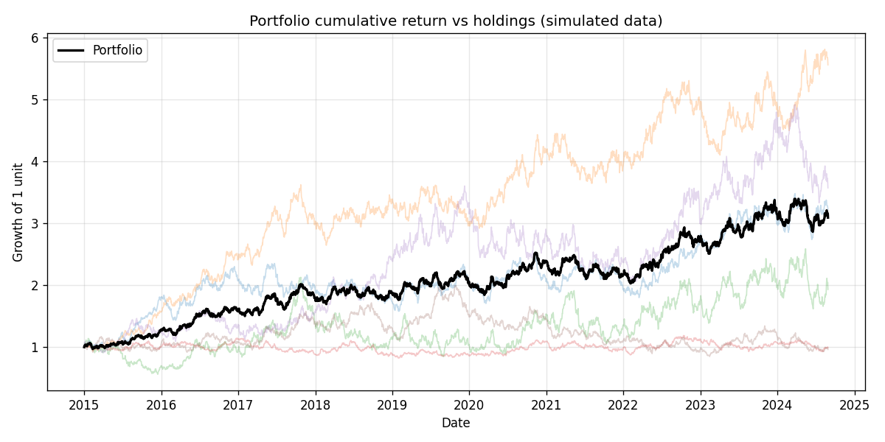
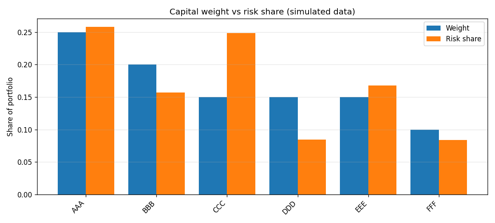
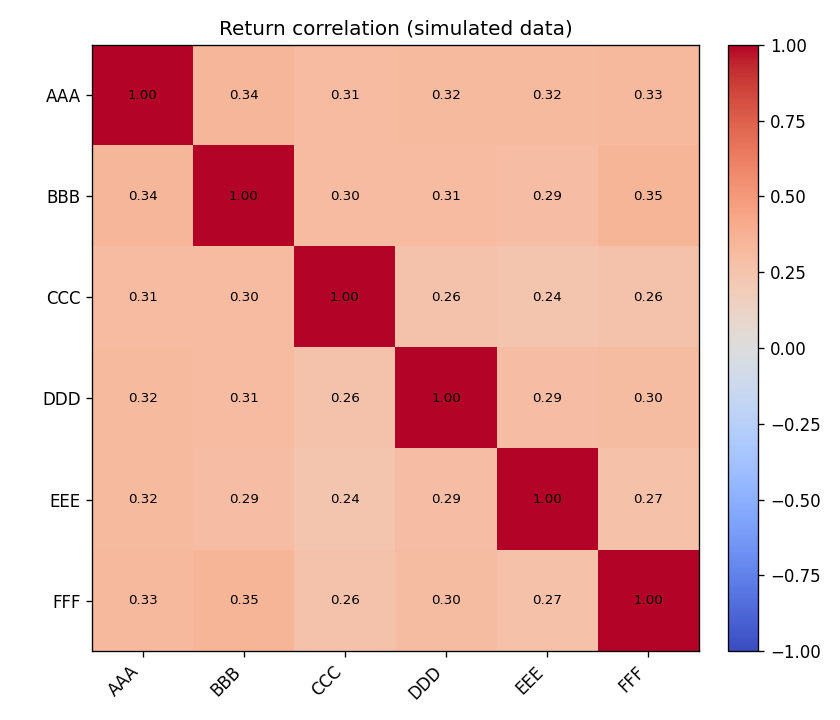

# Portfolio Analysis

A small toolkit for analyzing a stock portfolio in Python. Point it at a set of
holdings and it computes the returns, the risk, and the part most people skip:
where the risk actually comes from. A 10% position in a volatile, uncorrelated
name can carry far more risk than its weight suggests, and this repo makes that
visible.

The aim is to treat a portfolio the way a risk manager does, as a bundle of
exposures rather than a list of tickers, and to back that view with clear,
testable code.

## What it computes

Give it a list of holdings and weights and a date range. It returns:

- **Portfolio performance.** Total return, CAGR, annualized volatility, Sharpe,
  Sortino, max drawdown, and Calmar.
- **A per-holding breakdown.** Annualized return, volatility, and Sharpe for
  each name on its own, so you can see who is pulling weight and who is just
  adding noise.
- **Risk contributions.** A decomposition of the portfolio's volatility into
  how much each holding contributes. This is the heart of the project: the
  contributions sum exactly to the portfolio volatility, and the risk shares
  sum to one, so you can compare a holding's slice of the capital against its
  slice of the risk.
- **Charts.** Cumulative return against each holding, the drawdown curve, a
  correlation heatmap, and a weight-versus-risk bar chart.

## Why risk contribution matters

Capital weight and risk weight are not the same thing. Imagine two holdings at
equal 50% weight, one a steady utility and one a volatile growth stock. They
take up the same space in your capital, but the growth stock can easily account
for 70% or 80% of the portfolio's actual volatility. If you only look at
weights, you would think the book is balanced. The risk decomposition tells you
it is not.

This is the mental model the project is built to make concrete: manage the risk
shares, not just the dollar shares.

## Example output

The charts below come straight from the plotting code in this repo. The
committed versions here were generated on simulated data, so they show what the
output looks like. Run `python scripts/analyze.py --save-plots` to reproduce
them on live market data.



The weight-versus-risk chart is the one to look at. Notice how a holding can
take up far more of the risk than its share of the capital:





## How it works

| Module         | Responsibility                                            |
|----------------|-----------------------------------------------------------|
| `data.py`      | Load several tickers' adjusted close behind a swappable loader |
| `portfolio.py` | Normalize weights and build the portfolio return series   |
| `metrics.py`   | Daily-frequency performance statistics                    |
| `analysis.py`  | Correlations, per-asset stats, and the risk decomposition |
| `plotting.py`  | Cumulative return, drawdown, correlation, and allocation charts |

The portfolio return is modelled as a constant-weight book: weights are reset
to their targets each day. That is the cleanest definition of "a portfolio with
these weights" and it sidesteps the bookkeeping of letting weights drift. A
periodic-rebalance version is an obvious extension.

The risk decomposition uses the standard marginal contribution method. For
weights `w` and the annualized covariance matrix `S`, portfolio volatility is
`sqrt(w' S w)`, and holding `i` contributes `w_i * (S w)_i / volatility`.

## Getting started

```bash
git clone https://github.com/lamkelson/portfolio-analysis.git
cd portfolio-analysis
pip install -r requirements.txt
python scripts/analyze.py
```

Edit `config.yaml` to set your own holdings and weights. Weights are normalized,
so they do not need to add up exactly, and any holding you leave without a
weight splits the leftover equally. To save the charts:

```bash
python scripts/analyze.py --save-plots
```

## A note on what this is and is not

- **Past data, not a forecast.** Everything here describes how a portfolio
  *would have* behaved over the chosen window. Correlations and volatilities
  shift over time, and they tend to shift most in exactly the crises where you
  rely on them, so treat the risk decomposition as a snapshot, not a guarantee.
- **Constant weights.** The baseline rebalances daily to fixed weights. Real
  portfolios drift and rebalance on a schedule, which changes returns and
  turnover. That is a planned extension, not a hidden assumption.
- **No costs or taxes.** This is an analysis tool for a given set of holdings,
  not a trading backtest, so it does not model transaction costs or taxes.
- **Survivorship.** If you analyze a hand-picked set of names that did well,
  the results will look good for reasons that have nothing to do with portfolio
  construction. Choose the universe before you know the answer.

## Tests

```bash
pip install pytest
pytest
```

The suite runs on synthetic returns. It checks weight normalization, the
leftover-splitting rule, the weighted-average portfolio return, and that the
risk contributions decompose portfolio volatility exactly.

## Project layout

```
portfolio-analysis/
├── config.yaml
├── requirements.txt
├── scripts/
│   └── analyze.py
├── src/portfolio_analysis/
│   ├── data.py
│   ├── portfolio.py
│   ├── metrics.py
│   ├── analysis.py
│   └── plotting.py
└── tests/
    └── test_portfolio.py
```

## License

MIT. See [LICENSE](LICENSE).
